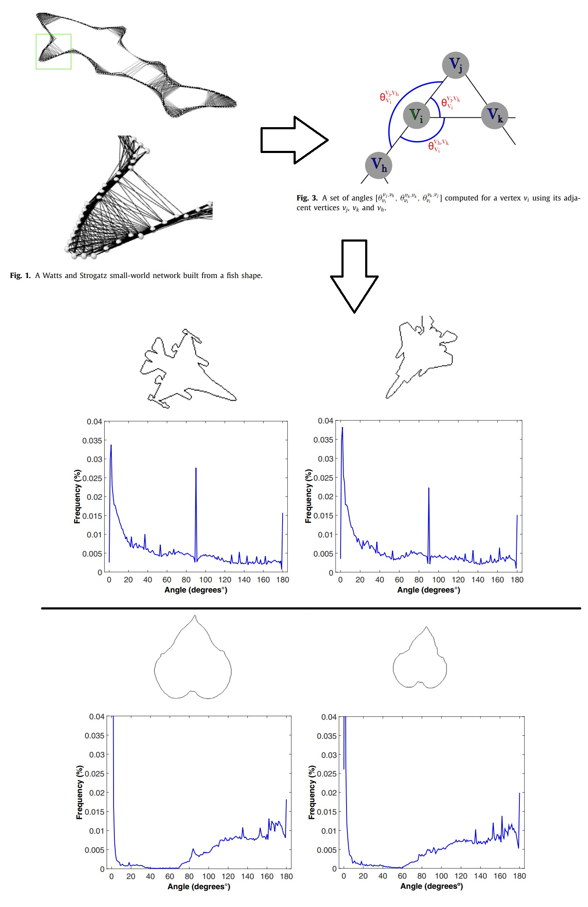

All the source codes necessary to calculate the Angular Descriptors of Complex Networks (ADCN), according to the paper (Scabini, Leonardo FS, et al. "Angular Descriptors of Complex Networks: a novel approach for boundary shape analysis." Expert Systems with Applications (2017)).

<p align="center">
    
</p>

*Do the following before using our codes:

	-Make sure all the shape-images are in the following format: pixels 0 indicates background and pixels 255 the boundary of the shape.
	-If you are not using a x64 linux system, make sure to compile the c++ source code CNangle_histogram.cpp using your MATLAB mex.


automaticThresolds: Calculates the mean and the standard deviation of Complex Network edges for training shape-images in a given path and a covering rate alpha (see Equations 8 to 10), and returns the initial and the final thresholds needed to calculate the ADCN.

getFeatures: After calculating the initial and final thresholds, use this function to compute the ADCN features to a given shape-image.

	getMeasures: This function calculates the statistical measures that compose the ADCN features (see equations in Table 1).
	
	CNangle_histogram: C++ code to perform the Complex Network and angular core computations.

CNangle_histogram.mexa64: A compiled function of the CNangle_histogram function for x64 linux. If you are using another operating system, make sure to compile the function with your MATLAB mex.

## Cite

If you use this method, please cite our paper:

Scabini, L. F., Fistarol, D. O., Cantero, S. V., Gonçalves, W. N., Machado, B. B., & Rodrigues Jr, J. F. (2017). Angular descriptors of complex networks: A novel approach for boundary shape analysis. Expert Systems with Applications, 89, 362-373.

```
@article{scabini2017angular,
  title={Angular descriptors of complex networks: A novel approach for boundary shape analysis},
  author={Scabini, Leonardo FS and Fistarol, Danilo O and Cantero, Savio V and Gon{\c{c}}alves, Wesley N and Machado, Bruno Brandoli and Rodrigues Jr, Jose F},
  journal={Expert Systems with Applications},
  volume={89},
  pages={362--373},
  year={2017},
  publisher={Elsevier}
}
```
